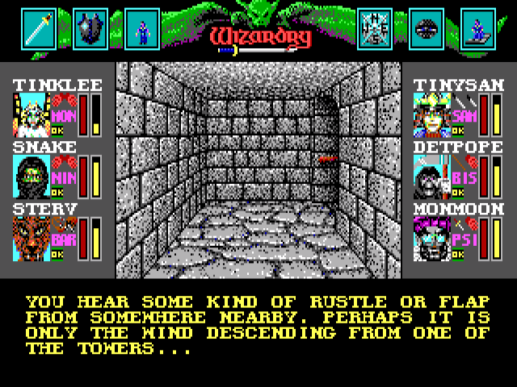
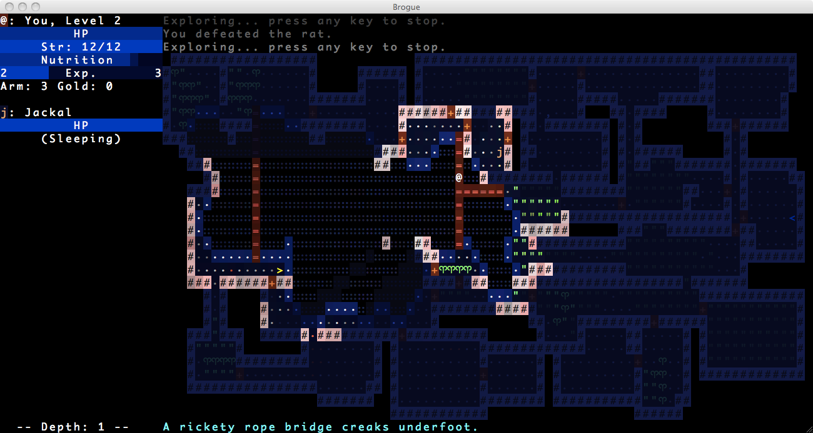
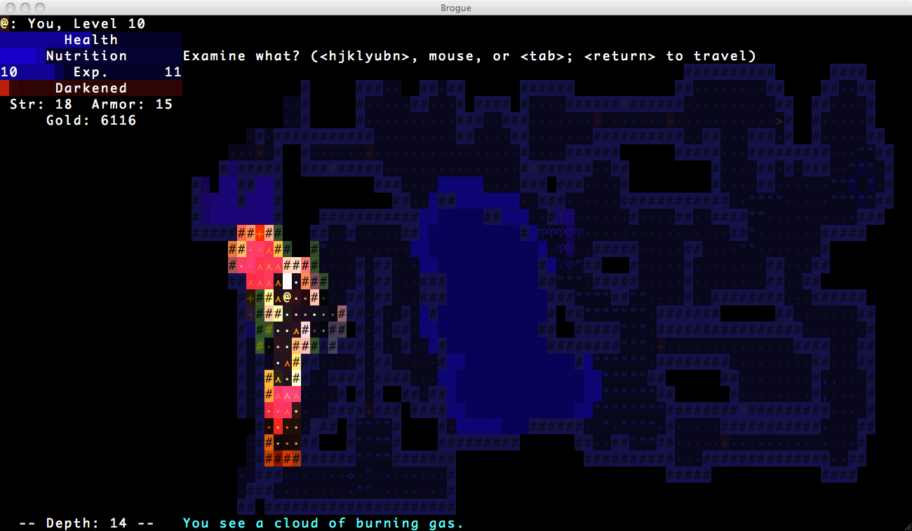

# Dungeons and the Underdark

In keeping with the general weirdness and paucity of the rest of my video gaming experience in the 1990's...

When people talk about dungeon crawlers, I don't so much think of _Eye of the Beholder_ or _Diablo_ or _Ultima Underworld_ or _The Bard's Tale_.  Rather, it's _Wizardry VI: Bane of the Cosmic Forge_.

And only that one, because I've never actually played any of the other _Wizardry_ games.

_Bane of the Cosmic Forge_, like _Zork_ and _The Goonies II_, fits into the large category of games that I never managed to beat without a walkthrough.  It's another ridiculously difficult game.

It's like _Zork_ in that it assumes that you are carefully mapping every move you make.  It's also like _Zork_ in that it will cheerfully allow you to render the game unwinnable.  Unlike _Zork_, it doesn't have the mechanism of the lantern's batteries limiting the amount of time you're actually able to play the game.  In my case, I played the game for, I think, a few years without realizing I'd managed to jam a door that was critical for further progression.  Every once in a while I'd start playing the game, mosey around the dungeon a bit, and not make any progress, and of course blame myself for my stupidity.

Sir-Tech also had a phone line you could call in for hints.  I don't recall them doing me much good.

But this isn't really about my grievances with ridiculously difficult relics, but what I actually find enjoyable and compelling about these games.

_Sidenote: I recently played through the three **Zork** games with my kid.  I still needed walkthroughs.  And he was, like me, baffled by the puzzles and mazes and frustrated that they even made it into the game.  I explained that the thinking at the time was that you were going to be mapping the game with pen and paper as you played it, but I'd never realized that when I played them.  All the same, that doesn't seem a terribly satisfying rationalization to me, 25-30 years later._

No, I really enjoyed the atmosphere and the structure of the dungeon, and exploring it.  It's true that every bit of the dungeon looked like every other bit of the dungeon.  And in fact the belfrey and the mines and the River Styx and the pyramid and even the damned forest looked like every other bit of the dungeon, which is... kind of amazing now.  How hard would it have been to make a second tileset?

But I digress.

In some areas, particularly around the castle towers, there were lovely bits of text as you explored.

Even in the graphical CRPGs of the time, they frequently had to add text to fill in the details of what the characters were experiencing.  And it's those bits of text that really made the dungeon interesting.

Seriously, what is _that_ about?  Of course, you can't ask, because you don't have any kind of prompt except in the brief dialogues you can enter with a few of the NPCs.

I think it's worth thinking about _Zork_, a dungeon crawler text adventure, _Bane of the Cosmic Forge_, a first-person dungeon crawler, an LPMUD like _After the Plague II_, and the general _Rogue_-like top-down grid-based dungeon crawler.  Compare and contrast. Discuss their strengths and weaknesses.

_Zork_ has by far the most interesting environments, but it cannot graphically render them.  Similarly, an LPMUD can have quite wonderful environments, better than _Zork's_ conceivably, but in practice this is limited by the literary abilities of the users crafting the MUD. _Bane of the Cosmic Forge_ and _Rogue_ are similarly limited to extremely repetitive views, and both can conceivably lean on text to add a bit of flavor that would otherwise be lacking.

_Bane of the Cosmic Forge_ offers a traditional RPG combat system, while _Zork_ had a very limited system that has, apparently, fallen by the wayside as interactive fiction has developed.  _Rogue_ has a highly technical combat system, similar to _Bane of the Cosmic Forge_, and it's turn-based (which tends to appeal to a more methodical mindset, I think).  A MUD has a realtime combat system with cooldowns and rate-limiting to avoid cheating, which makes it more like an action RPG like _Diablo_ or _EverQuest_.

Frankly, mapping is a bore, and I doubt most people did it even when _Zork_ or _Bane of the Cosmic Forge_ came out.  Of course, you have to just to be able to beat the damned games.  _Rogue_ is king here because it does the mapping for you.  That's... maybe the only thing that makes them tolerable.  MUDs often benefit greatly from mapping, but some MUD clients offer automapping, and the MUD is generally designed to _not_ require mapping, being as it is crafted by people who don't like mapping any more than you do.

I've contemplated having this game switch to a roguelike interface when in dungeons/dwarven kingdoms/underdark, but I feel like that's a cheap, easy answer that also happens to be _wrong_.  Part of what I don't really like about roguelikes is the endless screens of empty rooms with ridiculously long hallways and little or nothing in the way of character.  Sure, there are exceptions, like _Brogue_, which I have to say is gorgeous...

But still incredibly repetitive.

Now, when I was 14 or 15 or something, I started making an open-world interactive fiction game with TADS and I think I stopped because I couldn't find a Pascal compiler, which I needed because I wanted to increase the constant for the maximum number of rooms allowed, which I wanted to do so I could create like a thousand rooms that were nearly identical forest or grassland or whatever.  I really wanted you to _feel_ that open world.

I'm no longer _that_ big of an idiot.

But the fact remains that repetitive text rooms are just as bad as repetitive dungeon rooms.  Probably incalculably worse, actually, because you have to go to the effort of reading a room description and realizing it's the same damned thing you've already read.  At least with a roguelike you can pick it up at a glance, and see the l that means there's a fire lizard on the other room about to attack you so there's at least _something_ interesting.

The point is that I don't think that simply writing a text version of a roguelike dungeon crawl is going to be a satisfying (or  even bearable) experience.  And that I _really_, _really_ have to be careful with repetition in room descriptions.  Every room needs to at least _feel_ as though it was created with intent.

One thing I like about _Zork_, and which I think is necessary for a text dungeon crawl, is that rooms all have some unique descriptor.  The Loud Room.  The Dome Room.  The Carousel Room.  The Damp Passage.  The Treasure Room.  Not all rooms are like this, of course, but I think almost all rooms are _at least_ this distinctive.

This is a difficult idea to translate into the open world.  _The real world is repetitive._  So why wouldn't an open world, even in a fantasy game, be similarly repetitive?  But the moment a player types "w. w. w. w. w." and passes through five identical (or even similar) rooms, they're going to quit the game and never pick it up again.  And understandably so.  I would too!  That doesn't fill me with a sense of awe and wonder at the scale of this world/forest/dungeon/cavern.  It fills me with irritation that the developer has so little regard for my time.
